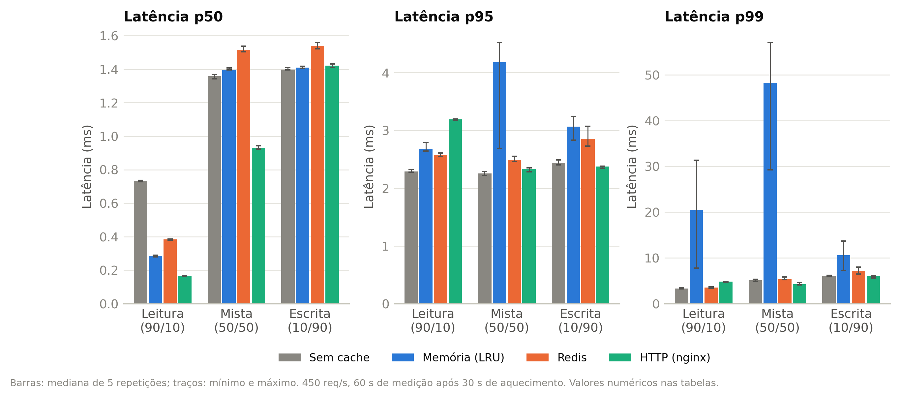
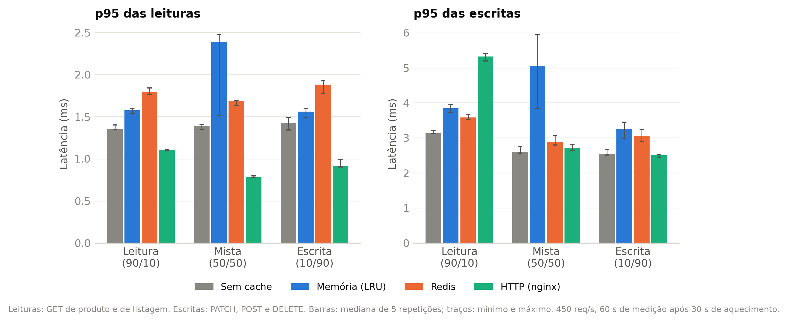
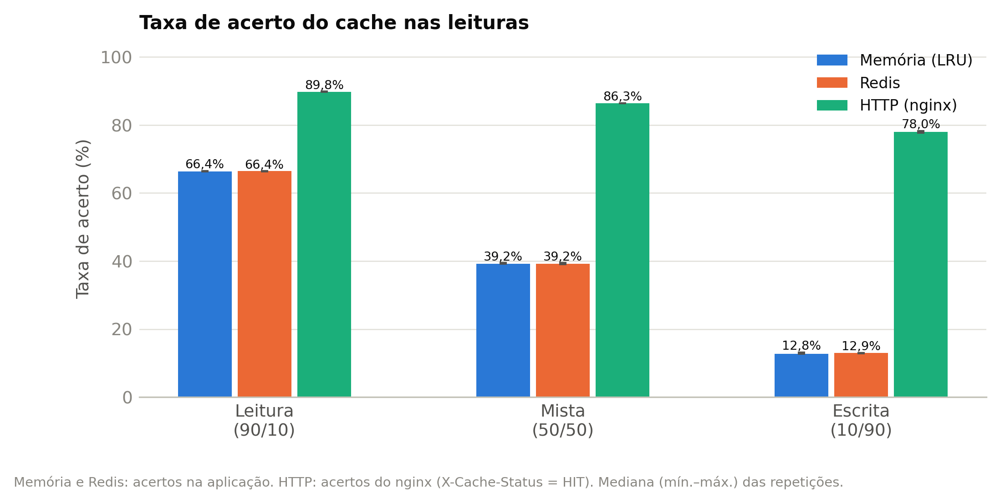
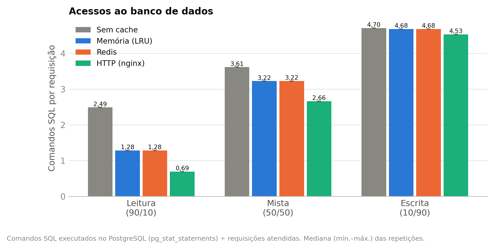
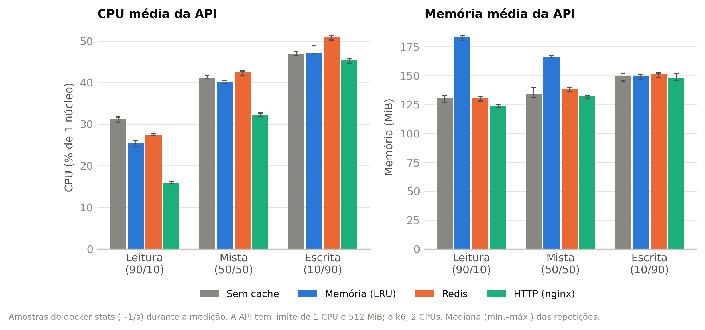
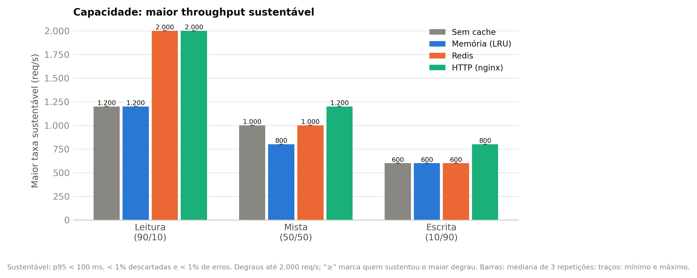
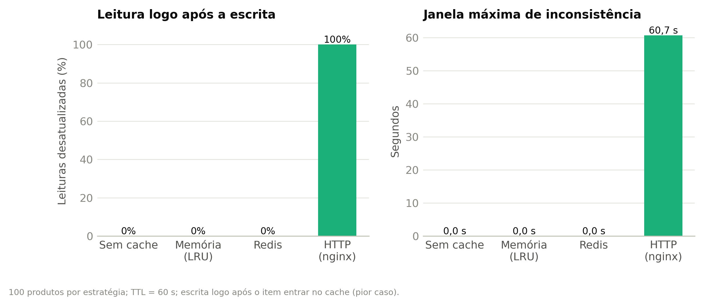
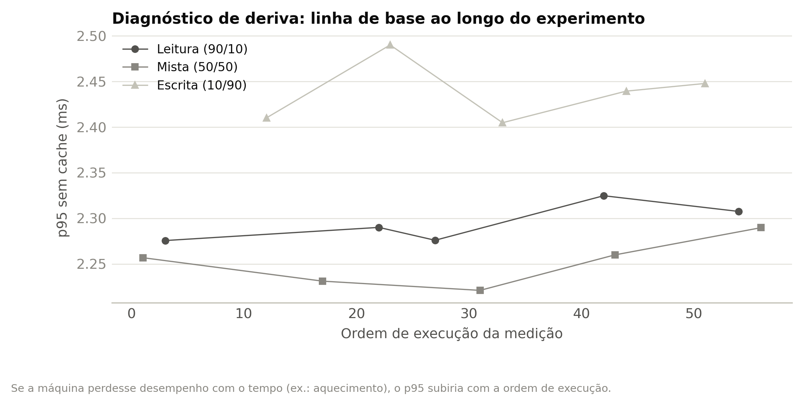

# Resultados dos experimentos

> Gerado automaticamente por `pnpm analise` em 23/09/2026 12:19 UTC, a partir dos dados em `results/`. Não edite à mão: rode a análise de novo.

## Ambiente e parâmetros

| Item | Valor |
|---|---|
| Máquina | Apple M1, 8 núcleos, 8 GiB (darwin 25.6.0 (arm64)) |
| Docker | 29.6.1 — VM com 8 CPUs e 3,8 GiB |
| Recursos | API 1 CPU / 512 MiB · PostgreSQL 2 CPUs / 1 GiB · Redis 1 CPU / 256 MiB · nginx 1 CPU / 256 MiB · k6 2 CPUs / 1 GiB |
| Taxa (experimento de latência) | 450 req/s (taxa de chegada constante) |
| Aquecimento / medição | 30 s / 60 s |
| Repetições | 5 por combinação (ordem sorteada em cada repetição) |
| TTL do cache | 60 s |
| Commit | 1dd154fd54 |

## E1 — Latência

| Carga | Estratégia | p50 (ms) | p95 (ms) | p95 mediana | p99 (ms) | p95 leituras | p95 escritas | Erros |
|---|---|---|---|---|---|---|---|---|
| Leitura (90/10) | Sem cache | 0,73 ± 0,00 | 2,29 ± 0,02 | 2,29 | 3,4 ± 0,1 | 1,37 ± 0,03 | 3,16 ± 0,05 | 0,00% |
| Leitura (90/10) | Memória (LRU) | 0,28 ± 0,00 | 2,70 ± 0,06 | 2,68 | 20,1 ± 8,3 | 1,57 ± 0,02 | 3,84 ± 0,09 | 0,00% |
| Leitura (90/10) | Redis | 0,38 ± 0,00 | 2,58 ± 0,03 | 2,58 | 3,5 ± 0,1 | 1,80 ± 0,03 | 3,59 ± 0,06 | 0,00% |
| Leitura (90/10) | HTTP (nginx) | 0,17 ± 0,00 | 3,19 ± 0,01 | 3,19 | 4,7 ± 0,1 | 1,11 ± 0,01 | 5,32 ± 0,08 | 0,00% |
| Mista (50/50) | Sem cache | 1,36 ± 0,01 | 2,25 ± 0,03 | 2,26 | 5,1 ± 0,2 | 1,39 ± 0,02 | 2,63 ± 0,08 | 0,00% |
| Mista (50/50) | Memória (LRU) | 1,40 ± 0,01 | 3,89 ± 0,77 | 4,18 | 47,1 ± 10,7 | 2,13 ± 0,44 | 5,06 ± 0,86 | 0,00% |
| Mista (50/50) | Redis | 1,52 ± 0,01 | 2,49 ± 0,04 | 2,49 | 5,5 ± 0,3 | 1,67 ± 0,02 | 2,89 ± 0,11 | 0,00% |
| Mista (50/50) | HTTP (nginx) | 0,93 ± 0,01 | 2,32 ± 0,03 | 2,33 | 4,3 ± 0,2 | 0,78 ± 0,01 | 2,71 ± 0,07 | 0,00% |
| Escrita (10/90) | Sem cache | 1,40 ± 0,01 | 2,44 ± 0,03 | 2,44 | 6,1 ± 0,1 | 1,42 ± 0,06 | 2,56 ± 0,06 | 0,00% |
| Escrita (10/90) | Memória (LRU) | 1,41 ± 0,00 | 3,04 ± 0,18 | 3,07 | 10,4 ± 2,4 | 1,55 ± 0,04 | 3,23 ± 0,19 | 0,00% |
| Escrita (10/90) | Redis | 1,54 ± 0,01 | 2,88 ± 0,14 | 2,85 | 7,1 ± 0,7 | 1,86 ± 0,06 | 3,04 ± 0,14 | 0,00% |
| Escrita (10/90) | HTTP (nginx) | 1,42 ± 0,01 | 2,37 ± 0,02 | 2,38 | 5,9 ± 0,2 | 0,93 ± 0,04 | 2,49 ± 0,03 | 0,00% |

Valores: média ± desvio padrão das repetições (e mediana do p95). Os gráficos mostram a mediana com mínimo e máximo, porque a latência de cauda é assimétrica.

### Testes estatísticos (p95)

Kruskal-Wallis (permutação, 20.000 reamostragens) entre as 4 estratégias e Mann-Whitney exato par a par, com ajuste de Holm por carga. Razão = mediana de B ÷ mediana de A (< 1: B mais rápida). Delta de Cliff: tamanho do efeito de B em relação a A.

| Carga | p (Kruskal-Wallis) | A × B | Razão B/A | Delta de Cliff | p (Holm) |
|---|---|---|---|---|---|
| Leitura (90/10) | < 0,001 | Sem cache × Memória (LRU) | 1,17 | 1,00 (grande) | 0,048 |
| Leitura (90/10) | < 0,001 | Sem cache × Redis | 1,12 | 1,00 (grande) | 0,048 |
| Leitura (90/10) | < 0,001 | Sem cache × HTTP (nginx) | 1,39 | 1,00 (grande) | 0,048 |
| Leitura (90/10) | < 0,001 | Memória (LRU) × Redis | 0,96 | -1,00 (grande) | 0,048 |
| Leitura (90/10) | < 0,001 | Memória (LRU) × HTTP (nginx) | 1,19 | 1,00 (grande) | 0,048 |
| Leitura (90/10) | < 0,001 | Redis × HTTP (nginx) | 1,24 | 1,00 (grande) | 0,048 |
| Mista (50/50) | < 0,001 | Sem cache × Memória (LRU) | 1,85 | 1,00 (grande) | 0,048 |
| Mista (50/50) | < 0,001 | Sem cache × Redis | 1,10 | 1,00 (grande) | 0,048 |
| Mista (50/50) | < 0,001 | Sem cache × HTTP (nginx) | 1,03 | 0,92 (grande) | 0,048 |
| Mista (50/50) | < 0,001 | Memória (LRU) × Redis | 0,60 | -1,00 (grande) | 0,048 |
| Mista (50/50) | < 0,001 | Memória (LRU) × HTTP (nginx) | 0,56 | -1,00 (grande) | 0,048 |
| Mista (50/50) | < 0,001 | Redis × HTTP (nginx) | 0,94 | -1,00 (grande) | 0,048 |
| Escrita (10/90) | < 0,001 | Sem cache × Memória (LRU) | 1,26 | 1,00 (grande) | 0,048 |
| Escrita (10/90) | < 0,001 | Sem cache × Redis | 1,17 | 1,00 (grande) | 0,048 |
| Escrita (10/90) | < 0,001 | Sem cache × HTTP (nginx) | 0,97 | -1,00 (grande) | 0,048 |
| Escrita (10/90) | < 0,001 | Memória (LRU) × Redis | 0,93 | -0,52 (grande) | 0,222 |
| Escrita (10/90) | < 0,001 | Memória (LRU) × HTTP (nginx) | 0,77 | -1,00 (grande) | 0,048 |
| Escrita (10/90) | < 0,001 | Redis × HTTP (nginx) | 0,83 | -1,00 (grande) | 0,048 |

Com 5 repetições por grupo, o menor p-valor possível no Mann-Whitney exato é 0,008 (antes do ajuste); diferenças com separação completa entre os grupos são o máximo detectável.

### Taxa de acerto, acessos ao banco e recursos

| Carga | Estratégia | Acerto | SQL/req | Redução SQL | CPU API | Mem. API (MiB) | CPU PG | CPU Redis | CPU nginx | CPU k6 (pico) |
|---|---|---|---|---|---|---|---|---|---|---|
| Leitura (90/10) | Sem cache | — | 2,49 ± 0,00 | — | 31 ± 0% | 130 ± 3 | 13% | 1% | 4% | 20% |
| Leitura (90/10) | Memória (LRU) | 66,4 ± 0,0% | 1,28 ± 0,00 | 49% | 25 ± 1% | 183 ± 2 | 9% | 1% | 4% | 28% |
| Leitura (90/10) | Redis | 66,4 ± 0,1% | 1,28 ± 0,00 | 49% | 27 ± 0% | 130 ± 2 | 9% | 3% | 4% | 32% |
| Leitura (90/10) | HTTP (nginx) | 89,8 ± 0,0% | 0,69 ± 0,00 | 72% | 16 ± 0% | 124 ± 1 | 5% | 1% | 4% | 33% |
| Mista (50/50) | Sem cache | — | 3,61 ± 0,00 | — | 41 ± 0% | 134 ± 4 | 15% | 1% | 3% | 23% |
| Mista (50/50) | Memória (LRU) | 39,3 ± 0,1% | 3,22 ± 0,00 | 11% | 40 ± 0% | 166 ± 1 | 14% | 1% | 3% | 28% |
| Mista (50/50) | Redis | 39,2 ± 0,2% | 3,22 ± 0,00 | 11% | 42 ± 0% | 138 ± 2 | 14% | 3% | 3% | 29% |
| Mista (50/50) | HTTP (nginx) | 86,3 ± 0,0% | 2,66 ± 0,00 | 26% | 32 ± 0% | 132 ± 1 | 10% | 1% | 3% | 19% |
| Escrita (10/90) | Sem cache | — | 4,70 ± 0,00 | — | 47 ± 0% | 149 ± 3 | 15% | 1% | 3% | 28% |
| Escrita (10/90) | Memória (LRU) | 12,9 ± 0,2% | 4,68 ± 0,00 | 1% | 48 ± 1% | 149 ± 2 | 15% | 1% | 3% | 25% |
| Escrita (10/90) | Redis | 12,9 ± 0,1% | 4,68 ± 0,00 | 1% | 51 ± 0% | 151 ± 2 | 15% | 2% | 3% | 24% |
| Escrita (10/90) | HTTP (nginx) | 78,0 ± 0,2% | 4,53 ± 0,00 | 4% | 45 ± 0% | 148 ± 2 | 15% | 1% | 3% | 23% |

CPU em % de um núcleo (100% = 1 CPU). O pico de CPU do k6 abaixo de 200% (limite do contêiner) indica que o gerador de carga não foi o gargalo.

## E2 — Capacidade (throughput máximo sustentável)

| Carga | Estratégia | Capacidade (req/s) | Repetições | Ganho vs. sem cache |
|---|---|---|---|---|
| Leitura (90/10) | Sem cache | 1.200 ± 0 | 1.200, 1.200, 1.200 | — |
| Leitura (90/10) | Memória (LRU) | 1.200 ± 0 | 1.200, 1.200, 1.200 | 1,00× |
| Leitura (90/10) | Redis | 2.000 ± 0 (atingiu o maior degrau) | 2.000, 2.000, 2.000 | 1,67× |
| Leitura (90/10) | HTTP (nginx) | 2.000 ± 0 (atingiu o maior degrau) | 2.000, 2.000, 2.000 | 1,67× |
| Mista (50/50) | Sem cache | 1.000 ± 0 | 1.000, 1.000, 1.000 | — |
| Mista (50/50) | Memória (LRU) | 800 ± 0 | 800, 800, 800 | 0,80× |
| Mista (50/50) | Redis | 1.000 ± 0 | 1.000, 1.000, 1.000 | 1,00× |
| Mista (50/50) | HTTP (nginx) | 1.200 ± 0 | 1.200, 1.200, 1.200 | 1,20× |
| Escrita (10/90) | Sem cache | 600 ± 0 | 600, 600, 600 | — |
| Escrita (10/90) | Memória (LRU) | 600 ± 0 | 600, 600, 600 | 1,00× |
| Escrita (10/90) | Redis | 600 ± 0 | 600, 600, 600 | 1,00× |
| Escrita (10/90) | HTTP (nginx) | 800 ± 0 | 800, 800, 800 | 1,33× |

Degraus testados: 400, 600, 800, 1.000, 1.200, 1.600, 2.000 req/s. A capacidade é o maior degrau sustentável, então a resolução é a distância entre degraus. Um degrau reprovado é medido de novo (confirmação) e só encerra a escada se reprovar outra vez. Com 3 repetições, os valores são descritivos (sem teste de significância).

## E3 — Consistência após escrita

| Estratégia | Leituras desatualizadas logo após a escrita | Janela média (s) | Janela máxima (s) |
|---|---|---|---|
| Sem cache | 0/100 (0%) | 0,0 | 0,0 |
| Memória (LRU) | 0/100 (0%) | 0,0 | 0,0 |
| Redis | 0/100 (0%) | 0,0 | 0,0 |
| HTTP (nginx) | 100/100 (100%) | 60,3 | 60,7 |

Memória e Redis invalidam a entrada na escrita (consistência imediata numa instância única da API). O cache HTTP do nginx não é invalidado pela escrita: o dado antigo é servido até o `max-age` (TTL) expirar. A medição representa o pior caso (escrita logo após o item entrar no cache); com idades de entrada distribuídas uniformemente, a janela esperada seria cerca de TTL/2.

## E0 — Calibração da taxa

| Carga | Taxa (req/s) | Medição | p95 (ms) | Descartadas | Sustentável |
|---|---|---|---|---|---|
| Leitura (90/10) | 200 | 1ª | 3,5 | 0 | sim |
| Leitura (90/10) | 300 | 1ª | 2,6 | 0 | sim |
| Leitura (90/10) | 400 | 1ª | 2,1 | 0 | sim |
| Leitura (90/10) | 500 | 1ª | 1,9 | 0 | sim |
| Leitura (90/10) | 600 | 1ª | 1,8 | 0 | sim |
| Leitura (90/10) | 700 | 1ª | 2,1 | 0 | sim |
| Leitura (90/10) | 800 | 1ª | 2,5 | 0 | sim |
| Leitura (90/10) | 1.000 | 1ª | 3,9 | 0 | sim |
| Leitura (90/10) | 1.200 | 1ª | 18,5 | 0 | sim |
| Mista (50/50) | 200 | 1ª | 3,3 | 0 | sim |
| Mista (50/50) | 300 | 1ª | 2,5 | 0 | sim |
| Mista (50/50) | 400 | 1ª | 2,3 | 0 | sim |
| Mista (50/50) | 500 | 1ª | 2,4 | 0 | sim |
| Mista (50/50) | 600 | 1ª | 2,6 | 0 | sim |
| Mista (50/50) | 700 | 1ª | 4,0 | 0 | sim |
| Mista (50/50) | 800 | 1ª | 11,4 | 0 | sim |
| Mista (50/50) | 1.000 | 1ª | 48,5 | 0 | sim |
| Mista (50/50) | 1.200 | 1ª | 5.252,9 | 2.663 | não |
| Mista (50/50) | 1.200 | confirmação | 5.253,6 | 2.933 | não |
| Escrita (10/90) | 200 | 1ª | 2,7 | 0 | sim |
| Escrita (10/90) | 300 | 1ª | 2,4 | 0 | sim |
| Escrita (10/90) | 400 | 1ª | 2,9 | 0 | sim |
| Escrita (10/90) | 500 | 1ª | 3,2 | 0 | sim |
| Escrita (10/90) | 600 | 1ª | 5,4 | 0 | sim |
| Escrita (10/90) | 700 | 1ª | 19,0 | 0 | sim |
| Escrita (10/90) | 800 | 1ª | 91,4 | 0 | sim |
| Escrita (10/90) | 1.000 | 1ª | 1.808,7 | 2.448 | não |
| Escrita (10/90) | 1.000 | confirmação | 1.782,3 | 2.258 | não |

Um degrau reprovado é medido uma segunda vez (confirmação); a escada só termina se ele reprovar de novo.

Taxa escolhida para o experimento de latência: 450 req/s (≈60% da menor capacidade sustentável da linha de base).

## Diagnóstico de deriva

| Carga | ρ de Spearman (ordem × p95 sem cache) | p95 observado (ms) | Amplitude | n |
|---|---|---|---|---|
| Leitura (90/10) | 0,80 | 2,28 – 2,32 | 0,05 ms | 5 |
| Mista (50/50) | 0,60 | 2,22 – 2,29 | 0,07 ms | 5 |
| Escrita (10/90) | 0,20 | 2,40 – 2,49 | 0,09 ms | 5 |

Com 5 repetições, o ρ só detecta tendência grosseira (com ρ = 1, o p bilateral seria 0,017) e precisa ser lido junto da amplitude: uma tendência monótona em variações de centésimos de milissegundo não tem efeito prático sobre a comparação entre estratégias. A ordem sorteada das combinações protege a comparação mesmo que haja alguma deriva.

## Arquivos

- `results/final/figs/01_latencia_percentis.png`
- `results/final/figs/02_latencia_leitura_escrita.png`
- `results/final/figs/04_taxa_acerto.png`
- `results/final/figs/05_acessos_banco.png`
- `results/final/figs/06_recursos_api.png`
- `results/final/figs/08_deriva.png`
- `results/final/figs/03_capacidade.png`
- `results/final/figs/07_consistencia.png`
- `results/final/tabelas/acerto_banco_recursos.csv`
- `results/final/tabelas/capacidade.csv`
- `results/final/tabelas/consistencia.csv`
- `results/final/tabelas/latencia.csv`
- `results/final/tabelas/testes_estatisticos.csv`

Dados de origem: `results/final/latencia-20260923-032122_1dd154f`, `results/final/capacidade-20260923-050209_1dd154f`, `results/final/consistencia-20260923-082123_1dd154f`, `results/final/calibracao-20260923-025932_1dd154f`
